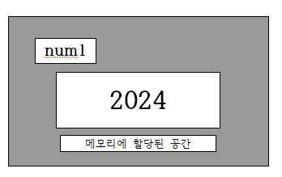
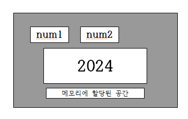
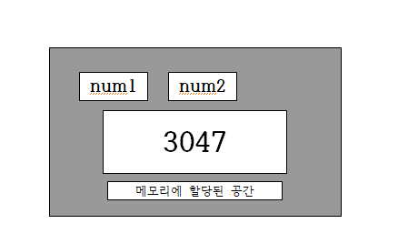
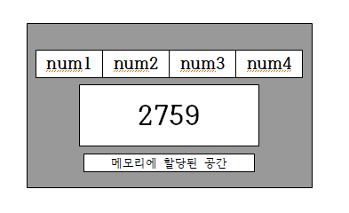

지금부터 설명하는 '참조자'라는 것은 성격상 포인터와 비유가 되기 쉽다.

하지만 참조자는 포인터를 모르는 사람도 이해할 수 있는 개념이다. 
따라서 포인터의 개념까지 끌어들여서 스스로를 괴롭히지 않았으면 좋겠다.

## 참조자(Reference)의 이해

무엇을 가리켜 변수라 하는가? 다음은 여러분이 잘 알고 있는 변수의 정의이다.

"변수는 할당된 메모리 공간에 붙여진 이름이다. 그리고 그 이름을 통해서 해당 메모리 공간에 접근이 가능하다."

그럼 다음과 같이 생각을 해볼 수 있다.

"할당된 하나의 메모리 공간에 둘 이상의 이름을 부여할 수는 없을까?"

친구를 이름으로 부르던 것을 별명으로 바꾸어서 부르는 것처럼 말이다.

이 질문이 참조자와 깊은 관계가 있다.

```cpp
int num1=2024;
```

위의 변수 선언을 통해서 2024로 초기화된 메모리 공간에 `num1`이라는 이름이 붙게 된다.



그런데 이 상황에서 다음의 문장을 실행하면, `num1`이라고 이름이 붙어있는 메모리 공간에는 `num2`라는 이름이 하나 더 붙게 된다.

```cpp
int &num2 = num1;
```

이 문장은 다소 혼란스러울 수도 있다. 왜냐하면 `&` 연산자는 변수의 주소 값을 반환하는 연산자이기 때문이다. 
하지만 위의 문장에서 보이듯이 `&` 연산자는 다른 의미로도 사용된다. 
이미 선언된 변수의 앞에 이 연산자가 오면 주소 값의 반환을 명령하는 뜻이 되지만, 새로 선언되는 변수의 이름 앞에 등장하면 이는 참조자 선언을 뜻하게 된다.

```cpp
int *ptr = &num1;  // 변수 num1의 주소 값을 반환해서 포인터 ptr에 저장해라!
int &num2 = num1;  // 변수 num1에 대한 참조자 num2를 선언해라!
```

따라서 변수 `num1`의 선언 이후에 다음 문장이 실행되면:

```cpp
int &num2 = num1;
```

`num2`는 `num1`의 '참조자'가 되며, 이는 다음의 결과로 이어진다. 



결과적으로 `num1`이라고 이름 붙어있는 메모리 공간에 `num2`라는 이름이 하나 더 붙은 꼴이 된다.

## "그럼 참조자도 변수?"

사실상 변수로 봐도 무리는 없다. 그 기능과 연산의 결과가 변수와 동일하다.
하지만, C++에서는 참조자와 변수를 구분해서 이야기한다. 이미 선언된 변수를 대상으로 만들어진 `num2`와 같은 것을 가리켜 변수라 하지 않고, '참조자'라는 별도의 이름을 정의해 놓았다.

어쨌든, 결과적으로는 위 그림의 형태를 띠기 때문에, 이어서 다음 문장을 실행하면:

```cpp
num2 = 3047;
```



변수 `num1`의 메모리 공간에 3047이 저장되어, 위 구조가 되며 이어서 다음의 두 문장을 실행하면:

```cpp
cout << num1 << endl;
cout << num2 << endl;
```

두 번에 걸쳐서 3047이 출력되는 것을 확인할 수 있다.

이렇듯 참조자는 자신이 참조하는 변수를 대신할 수 있는 또 하나의 이름인 것이다.

### 예제

```cpp
#include <iostream>
using namespace std;

int main(void)
{
    int num1 = 1020;
    int &num2 = num1;

    num2 = 3047;  // 결국에는 num1, num2 가리키는 게 같으므로 같은 메모리 공간에서 값을 지우고 넣은 것.
    cout << "VAL: " << num1 << endl;
    cout << "REF: " << num2 << endl;

    cout << "VAL: " << &num1 << endl;
    cout << "REF: " << &num2 << endl;
    return 0;
}
```

**출력결과:**

```plaintext
VAL: 3047
REF: 3047
VAL: 0x61fe14
REF: 0x61fe14
```

변수와 참조자는 선언의 방식에 있어서 확실한 차이를 보인다. 참조자는 변수를 대상으로만 선언이 가능하기 때문이다. 하지만 일단 선언이 되고 나면, 변수와 차이가 없다.

## 참조자는 "별칭"

개념적으로는 참조자를 이해했을 것이다. 그런데 전통적으로 C++에서는 참조자를 다음과 같이 설명한다.

>> 변수에 별명(별칭)을 하나 붙여주는 것이다. 

즉, 다음의 선언에서:

```cpp
int &num2 = num1;
```

`num1`이 변수의 이름이라면, `num2`는 `num1`의 별명이라는 뜻이다.

### 참조자의 수에는 제한이 없으며, 참조자를 대상으로도 참조자를 선언할 수 있다.

참조자의 수에는 제한이 없다. 즉, 다음과 같이 여러 개의 참조자를 선언하는 것도 가능하다.

```cpp
int num1 = 2759;
int &num2 = num1;
int &num3 = num1;
int &num4 = num1;
```

따라서 위의 문장들을 순서대로 실행하면, 하나의 메모리 공간에 `num1`, `num2`, `num3`, `num4`라는 이름을 붙인 꼴이 되며, 이를 그림으로 정리하면 다음과 같다.



그리고 참조자를 대상으로 참조자를 선언하는 것도 가능하다. 즉, 다음의 문장들을 순서대로 실행해도 같은 결과가 만들어진다.

```cpp
int num1 = 2759;
int &num2 = num1;
int &num3 = num2;
int &num4 = num3;
```

하지만, 필요 이상으로 참조자를 선언하는 것은 바람직하지 않다.

## 참조자의 선언 가능 범위

참조자는 변수에 대해서만 선언이 가능하고, 선언됨과 동시에 누군가를 참조해야만 한다. 즉, 다음의 선언은 유효하지 않다.

```cpp
int &ref = 20;
```

참조자는 본디, ++변수에 또 다른 이름을 붙이는 것++이기 때문에 상수를 대상으로 참조자를 선언할 수는 없다. 또한 참조자의 대상을 바꾸는 것도 불가능하다.

```cpp
int &ref;
```

당연히, 참조자를 선언하면서 `NULL`로 초기화하는 것도 불가능하다.

## 배열 요소에 대한 참조자의 선언 가능

```cpp
#include <iostream>
using namespace std;

int main(void)
{
    int arr[3] = {1, 3, 5};
    int &ref1 = arr[0];
    int &ref2 = arr[1];
    int &ref3 = arr[2];

    cout << ref1 << endl;
    cout << ref2 << endl;
    cout << ref3 << endl;
    return 0;
}
```

**출력결과:**

```plaintext
1
3
5
```

## 포인터 변수의 참조자 선언 가능

```cpp
#include <iostream>
using namespace std;

int main(void)
{
    int num = 12;
    int *ptr = &num;
    int **dptr = &ptr;
    
    int &ref = num;
    int *(&pref) = ptr;
    int **(&dpref) = dptr;

    cout << ref << endl;
    cout << *pref << endl;
    cout << **dpref << endl;

    return 0;
}
```

**출력결과:**

```plaintext
12
12
12
```

### 정리
1. 선언됨과 동시에 누군가를 참조해야함.
2. 상수를 대상으로 참조자를 선언할 수 없다.
3. 미리 참조자를 선언했다가 후에 참조하는 것은 불가능하다.
4. 참조의 대상을 바꾸는 것도 불가능하다.
5. 참조자를 선언하면서 NULL로 초기화 하는 것도 불가능하다.

이에 참조자의 선언 가능 여부와 참조자의 선언 방법에 대한 규칙을 설명함.


